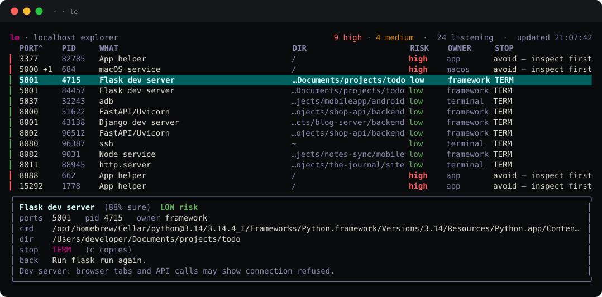

<div align="center">


# le — Localhost Explorer for the terminal

**See what's listening. Stop it the right way.**

[](https://github.com/alikatgh/le-cli/actions/workflows/ci.yml)
[](https://github.com/alikatgh/le-cli/releases/latest)
[](LICENSE)

`brew install alikatgh/tap/le` · [full tour](https://localhostexplorer.com/cli.html)

</div>

A fast, keyboard-driven TUI for seeing what's listening on your machine and
stopping it the right way. The terminal sibling of the
[Localhost Explorer](https://localhostexplorer.com) menu bar app — same
intelligence (it knows when `kill -9` won't stick), in a single static binary
that also runs on Linux servers over SSH.



## Why

`lsof -i :3000` tells you a PID. It doesn't tell you that the PID belongs to a
Homebrew service that launchd will respawn the moment you `kill -9` it. `le`
identifies the owner and picks the stop strategy that actually works:

- plain process → `SIGTERM`
- Homebrew service → `brew services stop <formula>`
- Docker container → `docker stop <name>`
- launchd user agent → `launchctl bootout gui/<uid>/<label>` (a KeepAlive
  agent respawns if you kill the PID — the supervisor is the thing to stop)
- system / app helpers → flagged with their launchd label, and it refuses
  to auto-kill them

**The rule underneath all of it: no signal without proven identity.** This is
the difference from `lsof | kill` — the point isn't sending the signal, it's
refusing to send one when the process behind a PID can no longer be proven to
be the process you scanned. Every stop re-verifies the PID's start time
immediately before acting (and a launchd bootout re-verifies the label→PID
mapping, and a docker stop the name→ID mapping); anything unproven gets a
refusal and a "rescan", never a guess. Fast-recycling PIDs are exactly the
boring edge case where naive port-killers hit the wrong process.

Every stop re-checks the PID's start time first, so a recycled PID is never the
one that gets signalled.

## Install

No Go toolchain needed — every path below ships a prebuilt binary
(macOS + Linux, amd64 + arm64).

One line, no package manager — downloads the latest release, verifies its
checksum, installs it ([read the script](install.sh) first if you sensibly
distrust `curl | sh`):

```sh
curl -fsSL https://localhostexplorer.com/install.sh | sh
```

Or by hand from the [Releases page](https://github.com/alikatgh/le-cli/releases):

```sh
tar -xzf le_*.tar.gz && sudo mv le /usr/local/bin/
```

Each release tarball carries a signed [build-provenance
attestation](https://docs.github.com/actions/security-guides/using-artifact-attestations-to-establish-provenance-for-builds)
— verify it came from this repo's CI before trusting it:

```sh
gh attestation verify le_*.tar.gz --repo alikatgh/le-cli
```

Homebrew (also installs man pages and shell completions):

```sh
brew install alikatgh/tap/le
```

From source (Go 1.24+):

```sh
go install github.com/alikatgh/le-cli@latest   # installs as `le-cli`; rename to `le` if you like
# or:
git clone https://github.com/alikatgh/le-cli && cd le-cli && go build -o le .
```

Needs `lsof` and `ps` (preinstalled on macOS; available on every Linux).
Homebrew and Docker detection are best-effort — missing tools are skipped.

## Use

```sh
le                 # launch the live TUI (default)
le list            # print a one-shot table and exit (alias: le ls)
le list node       # …filtered to rows matching "node" (port/name/cmd/dir/owner)
le list --json     # structured output for scripts / jq
le stop 3000       # stop whatever is on port 3000, the smart way
le stop 1183       # …or by PID
le stop --dir .    # stop every listener whose working dir is under this path
le stop 3000 --json  # …with per-listener results as JSON (works with -n too)
le stop --dir . -n # dry run: show what --dir would stop, without stopping it
le hold 3000       # squat a port so nothing else can grab it (Ctrl-C frees)
le wait 5432       # block until a port frees up
le ready 8080      # block until something starts listening (open-when-ready)
le ready 8080 -t 30s  # …but give up after 30s and exit 124 (for scripts)
```

`le --help` groups the full command set by what it's for — see what's
listening / stop it the right way / wait on a port / macOS housekeeping — and
every command has its own help: `le <command> --help`.

### In scripts

```sh
le ready 5173 && open http://localhost:5173   # open the browser the moment Vite is up
le wait 5432 && pg_ctl start                   # restart Postgres once the port clears
le ready 5432 -t 30s || echo "db never came up"  # bounded wait, non-zero on timeout
```

Exit codes are part of the contract, so a script can tell "not yet" from "no":

| code | meaning |
|-----:|---------|
| `0` | success |
| `1` | failure — nothing listening, stop refused, scan failed |
| `2` | usage error — unknown command/flag, bad args |
| `124` | a `--timeout` elapsed (same convention as `timeout(1)`) |

```sh
le wait 3000 -t 30s || { [ $? -eq 124 ] && echo "still busy"; exit 1; }
```

The exit codes and the `--json` field names are the two surfaces le promises
not to break silently — both are documented in
[docs/COMPATIBILITY.md](docs/COMPATIBILITY.md) and pinned by golden tests.

### Shell completions

The Homebrew install sets these up for you. Installing another way, wire them
up manually:

```sh
le completion zsh  > "${fpath[1]}/_le"                     # zsh
le completion bash | sudo tee /etc/bash_completion.d/le   # bash
le completion fish > ~/.config/fish/completions/le.fish   # fish
```

### Config

Optional `~/.config/le/config` (or `$XDG_CONFIG_HOME/le/config`):

```
interval = 2      # TUI refresh seconds (default 3)
filter   = node   # initial TUI filter (default none)
theme    = nord   # default / light / nord / dracula / solarized / mono /
                  # msdos / system7 / gameboy / phosphor / amber / paper /
                  # blueprint / vaporwave
```

Themes restyle the whole TUI — `light` for light-background terminals,
`mono` for colorblind-friendly no-color output (bold still marks high
risk). The retro block ports the mac app's native themes, so the same
identity travels between surfaces: `msdos` is CGA-on-Norton-Commander,
`system7` one-bit Macintosh, `gameboy` four shades of DMG olive,
`phosphor`/`amber` CRT glow, `paper` e-ink, `blueprint` cyanotype,
`vaporwave` Miami neon. (`system7`, `gameboy`, and `paper` are
dark-on-light — pair them with a light terminal.) `t` cycles them live;
the config line makes it stick. The current
theme, refresh cadence, and config path live in the `?` overlay's
settings section.

### Keys (TUI)

| key       | action                                   |
|-----------|------------------------------------------|
| `j` / `k` | move down / up                           |
| `g` / `G` | jump to top / bottom                     |
| `/`       | filter by port, name, folder (`esc` clears) |
| `1`-`6`   | sort by port / pid / what / risk / owner / dir (press again to reverse) |
| `x`       | stop the selected listener (asks first)  |
| `o`       | open `http://localhost:<port>/` in the browser |
| `c`       | copy the stop command — OSC 52, so it works over SSH |
| `r`       | refresh now                              |
| `t`       | cycle theme (persist with `theme = <name>` in config) |
| `?`       | help                                     |
| `q`       | quit                                     |

Wheel scrolls, left-click selects. The list auto-refreshes.

## Layout

```
scan/    enumerate TCP listeners via lsof + ps (pid, cmd, cwd, start time)
intel/   identify the process + pick the stop strategy + risk level
kill/    execute the strategy after a PID-recycle re-check
tools/   hold / wait / ready port helpers
ui/      the Bubble Tea TUI
cmd/     the Cobra command tree (per-command help + completions)
config/  optional ~/.config/le/config loader
main.go  entry point
```

## Want it always-on?

`le` is the terminal view. If you'd rather have it live in your menu bar with
one click before you kill, that's the companion app: https://localhostexplorer.com

## License

MIT — see [LICENSE](LICENSE).
